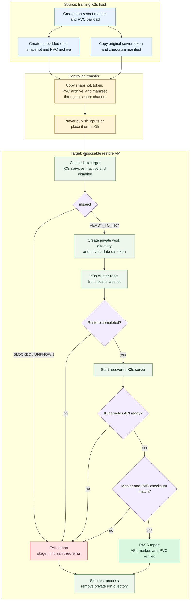

# k3s-restore-drill

**Test whether a K3s embedded-etcd snapshot and its original server token can be restored on a disposable VM.**

`k3s-restore-drill` is a safety-focused CLI for a question that snapshot creation alone cannot answer:

> Can this snapshot and its original server token boot a recovered K3s control plane on another host, and can that recovered API read state that existed before the snapshot?

It is intentionally a CLI, not a dashboard. Restore input contains cluster state and secrets; a web UI would add authentication, upload, storage, and attack-surface problems before the core recovery workflow is proven.

## The problem

K3s can create and list embedded-etcd snapshots, but a visible snapshot file is not proof of recovery. A usable recovery requires at least:

- the original K3s server token;
- a K3s binary compatible with the snapshot;
- a clean, separate Linux target;
- the right reset and startup sequence;
- proof that restored state is readable after startup.

Manual recovery is error-prone. It is easy to restore onto the wrong host, use the wrong token, start an empty default cluster by accident, or stop after seeing a responding API without checking recovered data.

This project turns the tested manual sequence into a repeatable drill with preflight guards, structured stages, sanitized reporting, and an explicit PASS/FAIL result.

## MVP promise

For the supported environment, `PASS` means:

1. K3s restored a supplied single-server or three-server-HA embedded-etcd snapshot on the disposable target.
2. The restored K3s API became ready.
3. The target read a ConfigMap marker created **before** the snapshot.
4. A temporary verification pod mounted the restored local-path PVC and matched its recorded SHA-256 checksum.

The report records topology, K3s version, snapshot size, duration, and completed stages. A local-path PVC is separate host-disk data, so its archive is required in addition to the etcd snapshot and token.

## Recovery-drill flow



`neb` and `ben` in a lab are examples only. The source and target must be different Linux environments; never run the reset on the source cluster.

## What `verify` does

1. **Preflight** — validates Linux, readable and nonempty inputs, POSIX token permissions, available disk, a dedicated work directory, and the absence of active or enabled `k3s`/`k3s-agent` services and default K3s state.
2. **Prepare** — validates the PVC manifest, safely extracts the local-path archive only beneath `/var/lib/rancher/k3s/storage`, and creates private snapshot/token copies.
3. **Restore and start** — invokes K3s only through argv lists, restores with `--cluster-reset`, then starts a normal recovered server.
4. **Verify** — waits for `/readyz` and for the recovered node to become Ready, reads the marker, then hashes the restored local-path payload without requiring an image pull. For HA, it preserves the PV's immutable source-node affinity and rebinds that recovered node's status to the disposable target IP.
5. **Report and cleanup** — emits a sanitized JSON report, terminates test K3s, deletes the restored local-path directory, and removes the unique run directory unless `--keep-artifacts` was requested.

## Supported scope

- Linux x86_64, root-operated, disposable and network-isolated target VM.
- K3s single-server and three-server HA embedded-etcd snapshots, restored to one target member.
- Local snapshot, original server token, local-path volume archive, and checksum manifest.
- A K3s binary compatible with the source snapshot and a non-secret pre-snapshot ConfigMap marker.

## Explicit non-goals

- Production restore.
- SQLite, external datastore, S3, or non-local-path storage recovery.
- Automatic VM provisioning, scheduling, dashboards, or SaaS.
- Application-health, image-registry, network, and database recovery.
- Replacing the official K3s restore implementation.

K3s performs the actual etcd restore and checksum work. This project orchestrates a guarded drill around it.

## Security boundary

Snapshots contain Kubernetes state and may contain sensitive material. Server tokens and kubeconfigs are secrets.

- Never commit snapshots, token files, kubeconfigs, real reports, or private keys.
- Never upload these inputs to GitHub issues, chat, paste services, or public storage.
- Use a disposable target isolated from the source-cluster and production networks.
- Preserve input files only as long as needed for the drill; remove temporary copies afterward.
- Review `report.json` before sharing. It is sanitized, but reports should still be treated as operational data.

See [SECURITY.md](SECURITY.md) for vulnerability reporting and [docs/supported-scope.md](docs/supported-scope.md) for the complete boundary.

## Before automation: prove the manual lab

Do not use `verify` as the first recovery attempt for a configuration. First create a training cluster, marker, snapshot, and separate target, then manually follow the [official K3s restore procedure](https://docs.k3s.io/cli/etcd-snapshot#restoring-snapshots).

Record the exact K3s version, server flags, hostname constraints, and observed duration. K3s startup can depend on version, certificates, installation settings, hostname, and restored state. The detailed training procedure is in [docs/lab.md](docs/lab.md).

## Install and run

The MVP has no runtime dependencies outside Python's standard library. From a checkout on the **disposable Linux target**:

```bash
cd /path/to/k3s-restore-drill
```

Run the CLI from source:

```bash
sudo env "PYTHONPATH=$PWD/src" \
  python3 -m k3s_restore_drill.cli --help
```

### 1. Inspect without changing K3s state

```bash
sudo env "PYTHONPATH=$PWD/src" \
  python3 -m k3s_restore_drill.cli inspect \
  --snapshot=/secure-backups/etcd-snapshot \
  --token-file=/secure-backups/server-token \
  --work-dir=/var/lib/k3s-restore-drill \
  --topology=ha
```

`READY_TO_TRY` means the local target prerequisites passed. It does **not** mean the token is correct or the snapshot is restorable.

### 2. Run a restore drill

Only run this on the dedicated target VM:

```bash
sudo env "PYTHONPATH=$PWD/src" \
  python3 -m k3s_restore_drill.cli verify \
  --snapshot=/secure-backups/etcd-snapshot \
  --token-file=/secure-backups/server-token \
  --work-dir=/var/lib/k3s-restore-drill \
  --expected-marker=k3s-drill-marker \
  --marker-namespace=drill \
  --topology=ha \
  --expected-pvc-checksum-file=/secure-backups/pvc-checksums.json \
  --pvc-volume-archive=/secure-backups/pvc-volume.tar.gz \
  --report=/home/operator/restore-report.json \
  --disposable-vm
```

`--disposable-vm` is mandatory because `verify` invokes `k3s server --cluster-reset` and writes test state on the target.

## Report and exit codes

The report does not include a token or Kubernetes resource contents. Its stable fields are:

```json
{
  "status": "PASS",
  "stage": "complete",
  "started_at": "2026-09-23T00:00:00Z",
  "duration_seconds": 29.3,
  "k3s_version": "k3s version vX.Y.Z+k3s1",
  "topology": "ha",
  "snapshot_size_bytes": 1048576,
  "api_ready": true,
  "marker_found": true,
  "pvc_checksum_match": true,
  "error_code": null,
  "hint": null
}
```

Exit codes:

| Code | Meaning |
| --- | --- |
| `0` | Drill passed. |
| `1` | Restore, startup, API, or marker verification failed. |
| `2` | Preflight blocked the drill or `inspect` found an unresolved prerequisite. |

## Lab evidence

The CLI was exercised end-to-end on separate Ubuntu 24.04 source and target VMs:

- source: three-server HA embedded-etcd; target: one disposable restore VM;
- source and target K3s: `v1.36.4+k3s1`;
- embedded-etcd snapshot: 5,271,584 bytes;
- marker: `drill/k3s-drill-marker`;
- result: `PASS`, API and recovered node ready, marker found, and local-path PVC SHA-256 matched;
- measured CLI drill duration: 52.926 seconds.

This is one lab result, not a compatibility promise for every K3s configuration.

## Why continue this project?

The technical core is now proven. Product value still needs validation: other operators must be able to run their own drills and report where they fail. The next priorities are clearer failure hints, tested K3s-version coverage, and feedback from real K3s operators—not a web UI.

## References

- [K3s backup and restore](https://docs.k3s.io/datastore/backup-restore)
- [K3s etcd snapshot commands](https://docs.k3s.io/cli/etcd-snapshot)
- [K3s server token options](https://docs.k3s.io/cli/server#cluster-options)
- [Example sanitized report](docs/example-report.json)
